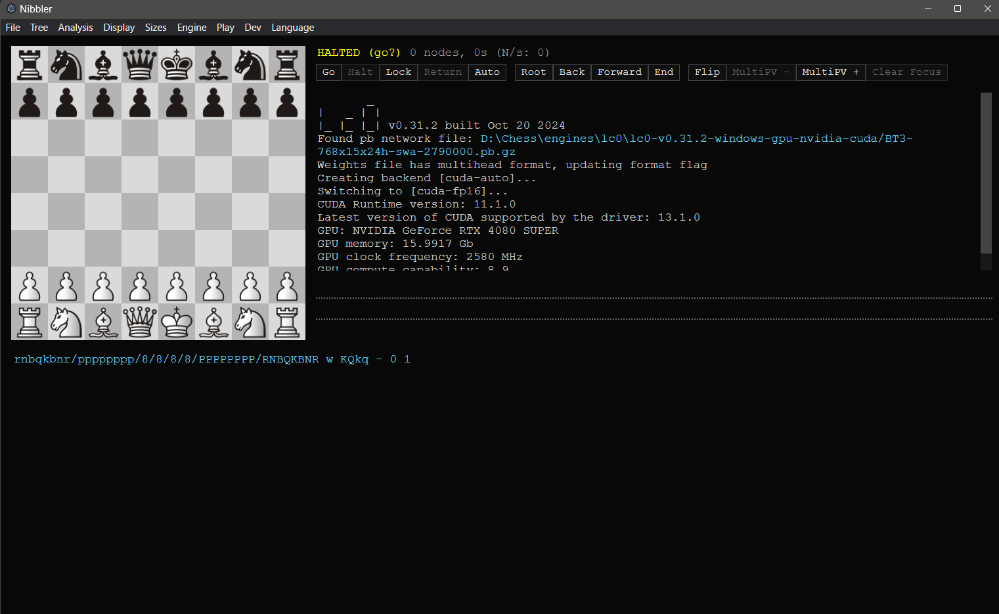

# Nibbler

Nibbler is a real-time chess analysis GUI for Leela Chess Zero (Lc0) and other UCI-compatible chess engines such as Stockfish.

It runs an engine in the background, continuously evaluates the current position, shows candidate moves visually, and lets you force analysis of selected moves. The project is historically based on the original Nibbler by Rooklift and is loosely inspired by Lizzie and Sabaki.

Current maintained fork: https://github.com/perejaslav/nibbler

Latest Windows release: https://github.com/perejaslav/nibbler/releases/tag/v2.7.0



## Highlights

- Real-time engine analysis for Lc0 and traditional UCI engines.
- Graphical display of top candidate moves.
- Winrate graph.
- Optional Leela statistics such as N, P, Q, S, U, V, and WDL.
- UCI `searchmoves` support.
- Automatic full-game analysis.
- Play against the engine from any position.
- Engine self-play from any position.
- PGN loading through menu, clipboard, or drag-and-drop.
- PGN variation support with arbitrary depth.
- FEN loading from clipboard or menu.
- Chess960 support.
- Analysis toolbar with quick access to engine controls, navigation, board flip, MultiPV, and focus clearing.
- Visual UCI engine settings dialog for standard engine options.

## What's new in 2.7.0

Version 2.7.0 adds an MVP visual settings dialog for UCI engine options.

- Added `Engine > Engine settings...`.
- Standard UCI option types can now be viewed and edited visually.
- Supported editable option types include `check`, `spin`, `combo`, and `string`.
- Current engine identity is shown in the dialog.
- Unknown or non-standard option types are handled safely instead of replacing the manual configuration workflow.
- Confirmed changes are saved through Nibbler's existing engine configuration path.
- Existing manual configuration through `engines.json` remains available.

Windows build for this release is available here:

https://github.com/perejaslav/nibbler/releases/tag/v2.7.0

## Installation

### Windows

1. Open the latest release page:
   https://github.com/perejaslav/nibbler/releases
2. Download `nibbler-2.7.0-windows.zip` or the newest available Windows archive.
3. Extract the archive to a folder of your choice.
4. Run `nibbler.exe`.
5. Configure your engine path from inside Nibbler if needed.

The 2.7.0 Windows build uses Electron 9.4.4.

### Run from source

Nibbler can also be run directly from source. This is useful for development or quick local checks.

Requirements:

- Node.js / npm
- Electron

From the repository root:

```bash
cd files/src
npx electron .
```

A global Electron install also works:

```bash
npm install -g electron
electron .
```

Nibbler is a classic Electron application. It does not require a modern JavaScript build step for normal development.

### Linux and macOS

The upstream project historically provided install scripts for Linux and macOS. They may still be useful, but they may not install this fork's latest release.

Legacy upstream Linux script:

```bash
curl -L https://raw.githubusercontent.com/rooklift/nibbler/master/files/scripts/install.sh | bash
```

Legacy upstream macOS script:

```bash
curl -L https://raw.githubusercontent.com/rooklift/nibbler/master/files/scripts/install_mac.sh | bash
```

For this fork, prefer the Releases page unless you specifically want to build or run from source.

## Engine setup

Nibbler works best when a UCI-compatible engine is configured correctly.

For Lc0, see the official Lc0 quickstart and configuration documentation:

- https://lczero.org/play/quickstart/
- https://lczero.org/play/configuration/flags/

For Stockfish and other traditional UCI engines, typical important options include:

- `Threads`
- `Hash`
- `MultiPV`

For maximum strength in some engines, `MultiPV` should often be kept at `1`, while `Threads` and `Hash` should be set appropriately for your hardware.

## Engine options

Engine options can be configured in several ways.

### Visual UCI settings dialog

Use:

```text
Engine > Engine settings...
```

The dialog shows known options for the current engine and provides visual controls for standard UCI option types:

- `check` — checkbox
- `spin` — numeric input
- `combo` — dropdown list
- `string` — text field

Confirmed changes are saved and applied through the existing engine configuration flow where possible.

### Manual configuration

Advanced users can still use manual configuration:

- Lc0 can load options from `lc0.config` at startup.
- Nibbler can send UCI options stored in its own `engines.json` file, available from the Dev menu.

Manual configuration remains the safest option for engine-specific, unusual, or unsupported settings.

## Analysis tips

The UCI `searchmoves` feature is available from the Analysis menu. Once enabled, one or more moves can be selected as focus moves. The engine will ignore other moves. This is useful when a move appears under-analysed.

When browsing principal variations on the right side of the interface, Nibbler can show the PV on the board without changing the actual analysed position. Halting the engine while inspecting PVs can make this easier, because the displayed lines will not keep changing.

Long searches can consume significant memory. If your engine runs out of RAM, consider setting a reasonable node limit from the Engine menu.

## Development notes

Nibbler's runnable source lives under:

```text
files/src
```

Important files include:

```text
files/src/main.js
files/src/nibbler.html
files/src/nibbler.css
files/src/renderer/
```

The project intentionally keeps the renderer simple and does not require React, Vue, TypeScript migration, or a bundler for ordinary changes.

To run syntax checks on changed JavaScript files:

```bash
node --check files/src/main.js
node --check files/src/renderer/90_engine.js
node --check files/src/renderer/95_hub.js
node --check files/src/renderer/94_uci_options_dialog.js
```

To run the app locally:

```bash
cd files/src
npx electron .
```

## Releases

Current release:

- v2.7.0 — https://github.com/perejaslav/nibbler/releases/tag/v2.7.0

All releases:

- https://github.com/perejaslav/nibbler/releases

## Upstream and credits

This repository is a maintained fork of the original Nibbler project by Rooklift:

- https://github.com/rooklift/nibbler

Thanks to everyone in the original Discord and GitHub community who contributed advice, testing, and suggestions. Thanks also to all Lc0 developers and GPU-hours contributors.

The chess pieces are from Lichess:

- https://lichess.org/

Icon design by ciriousjoker, based on this icon:

- https://github.com/ciriousjoker
- https://www.svgrepo.com/svg/155301/chess

## License

Nibbler is licensed under GPL-3.0. See `LICENSE.md` for details.
